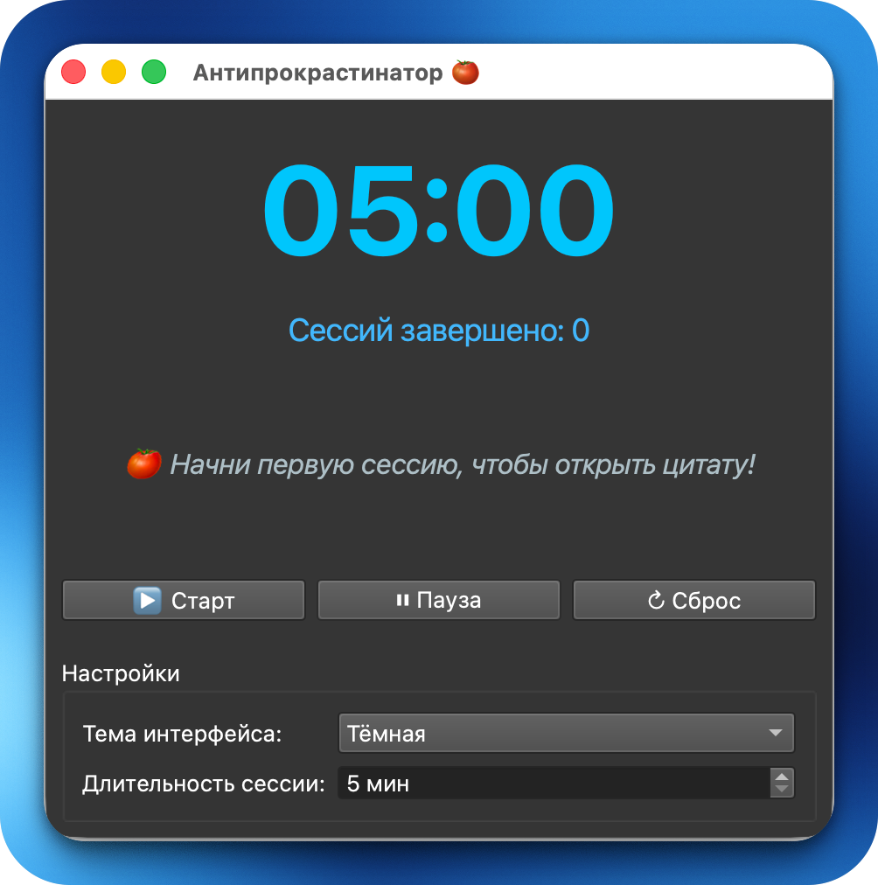
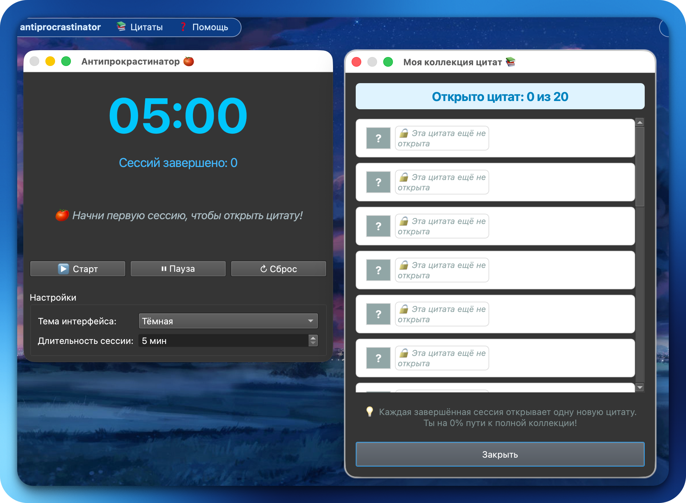
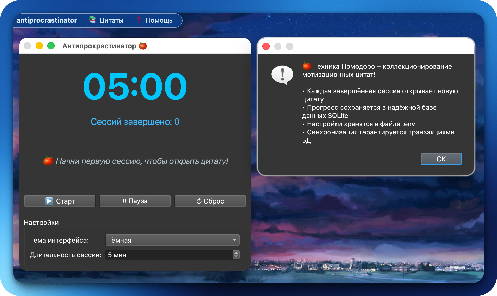
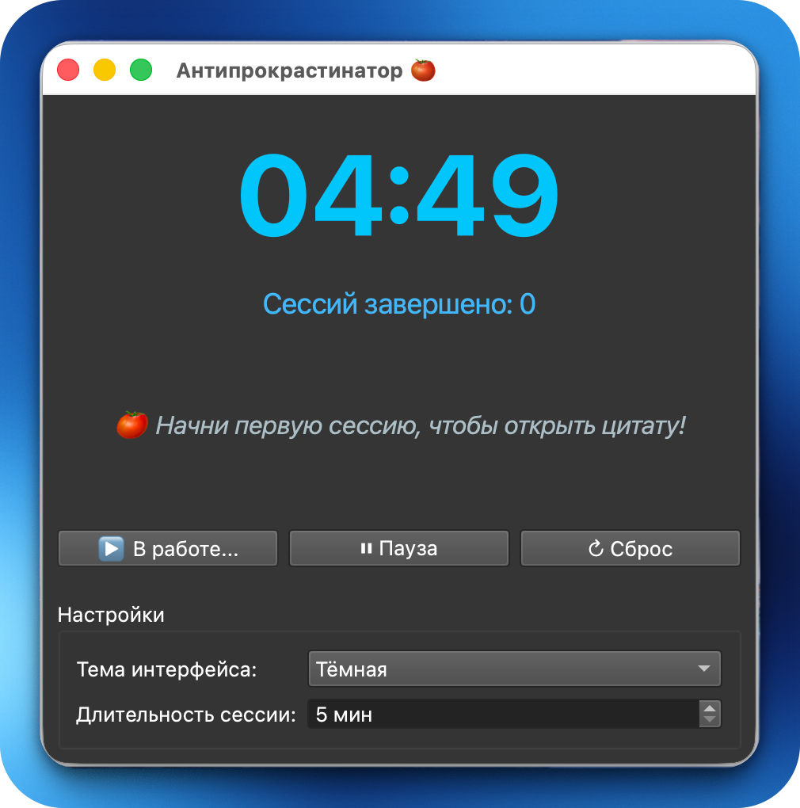
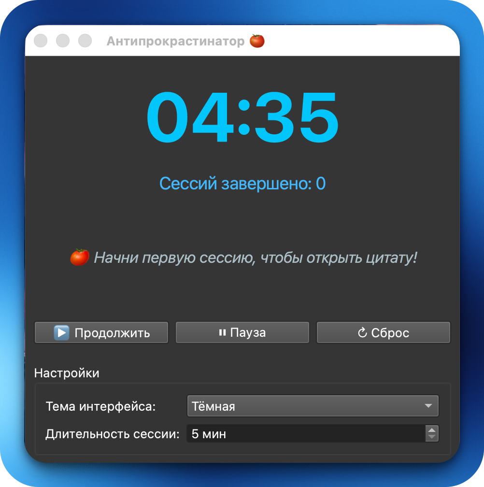
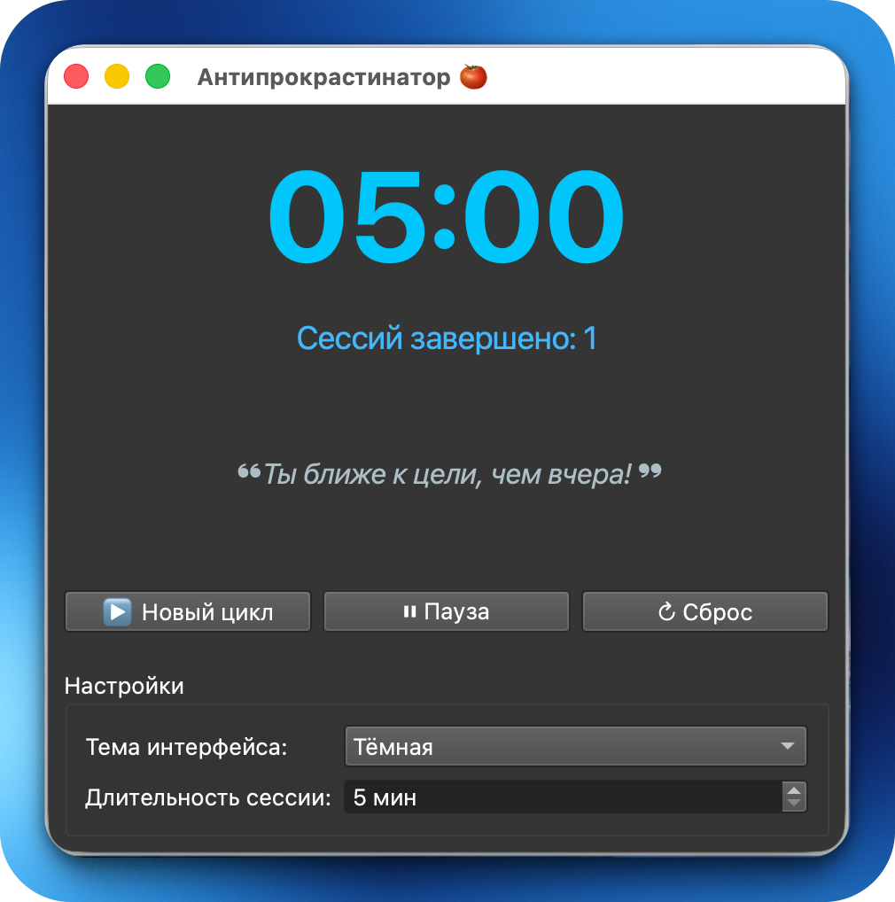
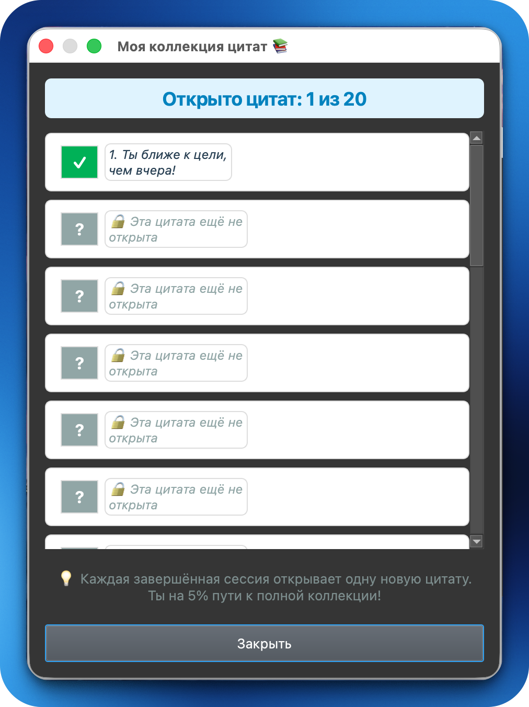

# Antiprocrastinator

Десктопный таймер Помодоро на Qt 6 и C++. Каждая завершённая сессия открывает одну мотивационную цитату — так постепенно формируется коллекция. Прогресс хранится в локальной базе данных SQLite и сохраняется между запусками.

## Возможности

- Настраиваемая длительность сессии (5-60 минут)
- Коллекция цитат: одна новая цитата за каждую завершённую сессию
- Просмотр всей коллекции в отдельном диалоговом окне
- Сохранение прогресса через SQLite (таблицы sessions и settings)
- Светлая и тёмная тема, выбор сохраняется между запусками
- Вся пользовательская конфигурация в одном файле `.env`
- Graceful degradation: при недоступной БД приложение продолжает работу без сохранения

## Требования

- Qt 6.8 или новее (модули Core, Gui, Widgets, Sql)
- CMake 3.19 или новее
- Компилятор с поддержкой C++17

## Сборка через консоль

```bash
git clone https://github.com/matv3yka/qt_pomodoro_timer.git
cd qt_pomodoro_timer
cmake -B build
cmake --build build
```

При сборке `quotes/quotes.txt` и `.env` автоматически копируются в директорию сборки.

## Настройка

Скопируйте `.env.example` в `.env` и отредактируйте по необходимости:

```
QUOTES_FILE_PATH=quotes/quotes.txt   # путь к файлу цитат, относительно исполняемого файла или абсолютный
DEFAULT_DURATION=25                  # длительность сессии в минутах
DEFAULT_THEME=light                  # light или dark
DB_PATH=.local/share/antiprocrastinator/progress.db  # относительно домашней директории или абсолютный
```

Если `.env` не найден, приложение использует встроенные значения по умолчанию и встроенный набор цитат.

Пути в `DB_PATH` и `QUOTES_FILE_PATH` могут быть как абсолютными, так и относительными. Относительные пути для цитат разрешаются относительно директории исполняемого файла; для БД — относительно домашней директории пользователя. Обратные слеши в путях (Windows) автоматически приводятся к прямым.

## Структура проекта

```
.
├── src/
│   ├── main.cpp
│   ├── headers/
│   │   ├── antiprocrastinator.h
│   │   └── quotesdialog.h
│   └── app/
│       ├── antiprocrastinator.cpp
│       └── quotesdialog.cpp
├── quotes/
│   └── quotes.txt
├── CMakeLists.txt
├── .env.example
└── .env
```

## Архитектура

Приложение состоит из двух классов.

**`Antiprocrastinator`** — главное окно (`QMainWindow`). Управляет таймером, состоянием сессии, взаимодействием с базой данных и логикой разблокировки цитат. При запуске последовательно выполняет: чтение `.env`, инициализацию БД, загрузку цитат из файла, восстановление прогресса из БД, построение интерфейса.

**`QuotesDialog`** — модальный диалог (`QDialog`) с прокручиваемым списком всей коллекции. Каждый элемент списка — виджет `QuoteItem`, который показывает либо текст открытой цитаты, либо заглушку для ещё недоступной. Открытые цитаты отмечены зелёным значком, закрытые — серым.

Таймер реализован через `QTimer` с интервалом 1000 мс и `QTime` для хранения оставшегося времени. Изменение длительности сессии и переключение темы во время активного отсчёта заблокированы.

## База данных

Прогресс хранится в SQLite по пути, указанному в `DB_PATH`. Директория создаётся автоматически при первом запуске.

Схема:

```sql
CREATE TABLE sessions (
    id               INTEGER PRIMARY KEY AUTOINCREMENT,
    start_time       DATETIME DEFAULT CURRENT_TIMESTAMP,
    duration_minutes INTEGER NOT NULL
);

CREATE TABLE settings (
    key   TEXT PRIMARY KEY,
    value TEXT NOT NULL
);
```

Таблица `settings` содержит два ключа: `theme` и `duration`. Начальные значения вставляются командой `INSERT OR IGNORE`, поэтому ручное изменение записей в БД не перезаписывается при следующем запуске.

Запись сессии и обновление настроек выполняются в отдельных транзакциях. При ошибке фиксации транзакция откатывается и пользователь получает предупреждение.

## Логика разблокировки цитат

Количество открытых цитат равно количеству записей в таблице `sessions`, но не превышает общего числа цитат в файле. При каждом завершении сессии новая запись добавляется в `sessions` в рамках транзакции, после чего следующая по счёту цитата помечается как открытая в памяти. Порядок цитат соответствует порядку строк в файле.

После завершения сессии приложение показывает всплывающее уведомление с итогами (номер сессии, счётчик открытых цитат) и анимированную подсветку области цитаты в главном окне.

## Добавление цитат

Откройте `quotes/quotes.txt` и добавляйте по одной цитате на строку. Строки, начинающиеся с `#`, считаются комментариями и игнорируются. Файл должен быть в кодировке UTF-8.

Если файл недоступен или не найден ни по одному из проверяемых путей, приложение автоматически переключается на встроенный резервный набор из 10 цитат и продолжает работу в штатном режиме.

## Поведение при ошибках

| Ситуация | Поведение |
|---|---|
| `.env` не найден | Используются значения по умолчанию |
| Файл цитат не найден | Используется встроенный резервный набор |
| БД не удалось открыть | Предупреждение при старте, работа без сохранения прогресса |
| Ошибка записи сессии | Транзакция откатывается, показывается предупреждение |

## Пример использования











